# 栈　队列

## July 15, 2018, riteme

***

###### 你们都应该知道的东西

确认一下你们都知道这些东西......方便后面交流......

---

$O(\cdot)$、$\Theta(\cdot)$ (大 $\theta$)、$\Omega(\cdot)$ 记号，常用于表示时间、空间复杂度。

---

$O(\cdot)$ 表示上界，$\Omega(\cdot)$ 表示下界：

$$
\begin{aligned}
f(x) = O(g(x)) & \Longleftrightarrow \exists\,x_0, k:\: k \cdot g(x) >f(x)\:\forall\,x > x_0 \\
f(x) = \Omega(g(x)) & \Longleftrightarrow \exists\,x_0, k:\: k \cdot g(x) < f(x)\:\forall\,x > x_0 \\
f(x) = \Theta(g(x)) & \Longleftrightarrow f(x) = O(g(x)) \text{ and } f(x) = \Omega(g(x))
\end{aligned}
$$
通常你们只会用到 $O(\cdot)$。

***

###### 你们都应该知道的东西

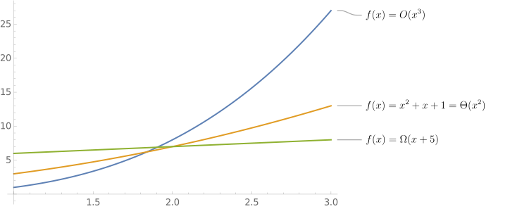

***

###### 指数与对数

当 $a \neq 0$ 时，$a^x$ 表示**指数函数**。

---

**对数函数**是指数函数的*反函数*，记做 $\log_a x$，$a$ 称为**底数**。当 $y = a^x$ 时，$x = \log_a y$。注意 $a \neq 0, 1$。

或者说 $a^{\log_a x} = x$。

---

$$
\begin{aligned}
\log_a b + \log_a c & = \log_a bc \:\:\:\: (a^{x + y} = a^xa^y)\\
\log_a b - \log_a c & = \log_a b/c \:\:\:\: c \neq 0 \\
\log_a b^c & = c \log_a b \\
\log_a b & = \log_c b / \log_c a \text{ (换底公式)}\\
(\log_a b) \cdot (\log_a c) & \neq \log_a bc \\
(\log_a b) / (\log_a c) & \neq \log_a b/c
\end{aligned}
$$

---

以上**等式**两边同时取指数可以证明。

---

**自然常数 / 自然对数的底数** $\newcommand{\e}{\mathrm{e}}\e = 2.71828\cdots$

**自然对数** $\ln x = \log_e x$、**常用对数** $\lg x = \log_{10} x$，**二进制对数** $\log x = \log_2 x$。

***

###### 示例

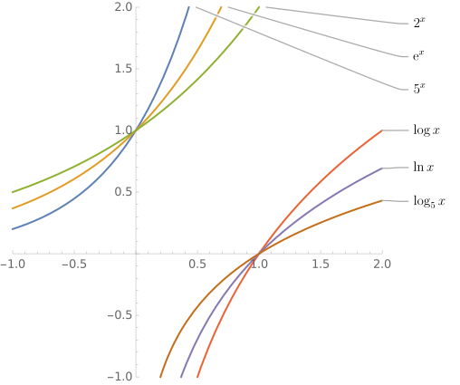

---

注意函数图象关于 $y = x$ 对称。

---

指数函数增长迅速，对数函数增长缓慢。

***

###### 小试牛刀

已知 $\ln 2 \approx 0.69$、$\ln 3 \approx 1.10$、$\ln 5 \approx 1.61$、$\ln 7 \approx 1.95$：
$$
\newcommand\e[0]{\mathrm{e}}
\begin{aligned}
\ln \e^{10086} &=\ ? \\
\log 2048 &=\ ? \\
\lg 10000000000 &=\ ? \\
\ln 360 &\approx\ ? \\
\lg \e &\approx\ ?
\end{aligned}
$$

***

###### 小试牛刀

已知 $\ln 2 \approx 0.69$、$\ln 3 \approx 1.10$、$\ln 5 \approx 1.61$、$\ln 7 \approx 1.95$：

$$
\newcommand\e[0]{\mathrm{e}}
\begin{aligned}
\ln \e^{10086} &= 10086 \\
\log 2048 &= 11 \\
\lg 10000000000 &=10 \\
\ln 360 &\approx 5.88 \\
\lg \e &\approx 0.434
\end{aligned}
$$

---

Got it?

***

######  ~~大得多~~定理

当正整数 $n \rightarrow \infty$ 时：
$$
n^n \gg n!\gg a^n \gg n^b \gg \ln^k n
$$

($a > 1$、$b > 0$、$k \geqslant 0$)

---

小测试：（尽量使 "$?$" 中的内容简单、有意义）
$$
\begin{aligned}
2\,x^3 - 10^9\,x^2 - 1 &= \Theta(?) \\
2^nn^2+3^{n + 1} &= \Theta(?) \\
\sin \cos \sin \cos x &= \Theta(?) \\
n^2\log n^2 &= \Theta(?)
\end{aligned}
$$

***

######  ~~大得多~~定理

当正整数 $n \rightarrow \infty$ 时：
$$
n^n \gg n!\gg a^n \gg n^b \gg \ln^k n
$$

($a > 1$、$b > 0$、$k \geqslant 0$)

小测试：（尽量使 "$?$" 中的内容简单、有意义）

$$
\begin{aligned}
2\,x^3 - 10^9\,x^2 - 1 &= \Theta(x^3) \\
2^nn^2+3^{n + 1} &= \Theta(3^n) \\
\sin \cos \sin \cos x &= \Theta(1) \\
n^2\log n^2 &= \Theta(n^2\log n) = \Theta(n^2 \ln n)
\end{aligned}
$$

***

###### 进入正题

**栈**与**队列**是最基础的两种数据结构。

---

栈中的元素**先入后出**，就像摆在桌面上的一堆书，先堆上去的书垫在底下。从顶上一本一本取出来时，最先放上去的书最后取出来。

---

队列中的元素**先入先出**，可以类比到食堂打饭，先到先得。

***

###### 具体实现：栈

假设已经知道栈中最多同时存在 $n$ 个元素，那么可以使用一个大小为 $n$ 的数组实现栈。

---

记录 `top` 表示栈顶的位置（或者说栈中元素个数），初始时栈顶为 $0$。

---

```
int top = 0
int stk[n]  // 栈：大小为 n 的数组

function push(int x):  // 压栈（将 x 加入栈中)
	stk[top++] = x

function get_top():  // 访问栈顶元素
	return stk[top - 1]

function pop():  // 弹栈（删除栈顶元素）
	return stk[--top]
```

---

So easy?

***

###### 具体实现：队列

同样记 $n$ 表示最多同时存在于队列中的元素个数。如果用大小为 $n$ 的数组实现需要一点技巧。

---

为了充分利用空间，我们将循环使用数组。记录队列的头指针 `head` 和尾指针 `tail`，当它们触及数组边界时，就回到数组开头的位置。

---

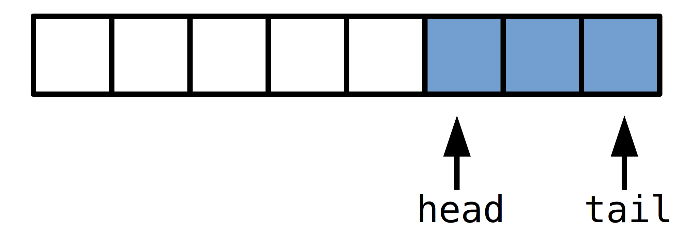

***

###### 具体实现：队列

同样记 $n$ 表示最多同时存在于队列中的元素个数。如果用大小为 $n$ 的数组实现需要一点技巧。

为了充分利用空间，我们将循环使用数组。记录队列的头指针 `head` 和尾指针 `tail`，当它们触及数组边界时，就回到数组开头的位置。

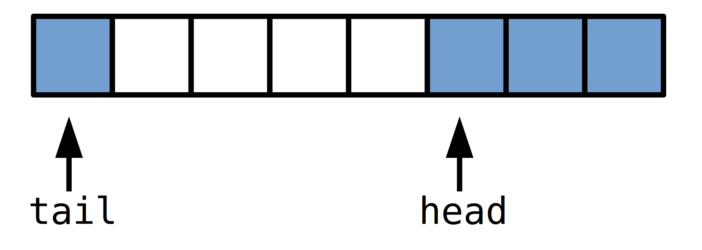

***

###### 具体实现：队列

同样记 $n$ 表示最多同时存在于队列中的元素个数。如果用大小为 $n$ 的数组实现需要一点技巧。

为了充分利用空间，我们将循环使用数组。记录队列的头指针 `head` 和尾指针 `tail`，当它们触及数组边界时，就回到数组开头的位置。

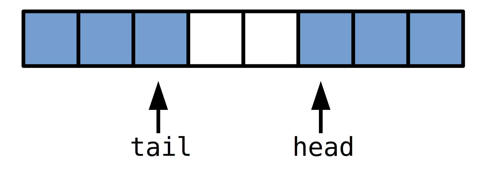

***

###### 具体实现：队列

同样记 $n$ 表示最多同时存在于队列中的元素个数。如果用大小为 $n$ 的数组实现需要一点技巧。

为了充分利用空间，我们将循环使用数组。记录队列的头指针 `head` 和尾指针 `tail`，当它们触及数组边界时，就回到数组开头的位置。

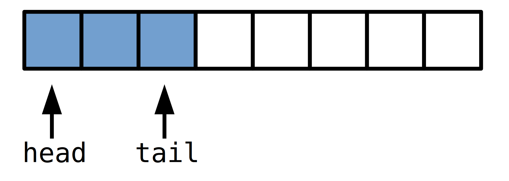

---

类似于在一个圆环上兜圈。

***

###### 具体实现：队列

```python
int head = 0
int tail = -1
int queue[n]

function push(int x):  // 入队（加入队列）
    tail++
    if (tail == n) tail = 0
    queue[tail] = x

function pop():  // 队首出队
    head++;
    if (head == n) head = 0
```

---

So easy?

***

###### `vector` & `deque`

C++ 标准库中的 `std::vector`，支持在末端快速加入、删除。在**末端**加入、删除的**均摊**时间复杂度均为 $\Theta(1)$。存入 $n$ 个元素的空间复杂度为 $\Theta(n)$。

---

`vector` 的内部维护了一个大小为 $s$ 的数组。记实际存入的元素个数为 $n$，数组的利用率 $\alpha = n/s$。`vector` 保持 $\alpha \in [1/4,\,1]$，并且一旦超出这个范围，就通过重新分配数组大小来使得 $\alpha = 1/2$。

---

当 $\alpha  = 1$ 时，继续插入则没有足够的空间，需要将数组扩大一倍使得 $\alpha = 1/2$。同理，当 $\alpha = 1/4$ 时，继续删除就需要将数组缩小一倍。

---

当然，重新分配一个大小为 $s$ 的数组的时间复杂度为 $\Theta(s)$。所以 `vector` 的**单次**插入删除操作的时间复杂度为 $O(n)$。然而，实际上并不会每次插入删除都要重新分配数组，大多数情况下都只需要简单的插入、删除即可。实际上连续的 $n$ 次插入的时间复杂度不会是 $\Theta(n^2)$，而是 $\Theta(n)$，也就是之前所说的均摊 / 平均复杂度为 $\Theta(1)$（$n$ 次插入均分总时间）。

***

###### `vector：`时间复杂度分析

 “**时间就是金钱！**” 假设插入和删除操作本身要花 $1$ 块钱，而重新分配数组要花 $2s$ 或者 $s$ 块钱（扩大或者缩小）。现在我们把重新分配数组的代价摊给插入和删除：插入和删除一个元素花 $5$ 块，其中有 $4$ 块存到银行。

---

如果是要扩大数组，那么在上次扩大之后，至少有 $s/2$ 次插入操作，这些操作一共存了 $4 \times (s/2) = 2s$ 元，扩大数组的资金就已经出来了！所以这一次扩大数组可以视作免费的！

---

同理，如果是要缩小数组，继上次重新分配之后，至少执行了 $s/4$ 个删除操作。它们一共在银行里存了 $4 \times (s/4) = s$ 元，也恰好能支付缩小数组的花费。

---

换句话说，每次操作的平均代价不超过 $5 = \Theta(1)$。也正是 `vector` 在尾部插入、删除的时间复杂度。

***

###### `vector` & `deque`

`deque` 是 **D**ouble-**E**nded **Que**ue 的缩写，即**双端队列**。支持在队列两头快速插入 / 删除。

---

`deque` 的实现与 `vector` 差不多，只不过我们循环使用数组。并且当根据数组的使用率，像 `vector` 那样及时重新分配。时间复杂度的分析也如出一辙。

---

C++ 标准库的 `deque` 还稍微复杂一些。它以 $K$ 个元素作为一个区块来存储。实际的循环队列里面依次存储了指向每个区块的指针。这样做避免需要重新分配数组时重新复制所有的元素的操作，而只需要复制那些指针即可。

***

###### `stack` & `queue`

C++ 标准库提供了基本的栈和队列的类，分别是 `std::stack` 和 `std::queue`。

---

分别在 `<stack>` 和 `<queue>` 头文件中。使用方法与 `vector`、`deque` 类似。

---

这两者默认都是用 `deque` 实现的。

---

```python
stack<int> stk;  // 声明一个栈 stk
stk.push(1)  // 将 1 压栈
stk.top()  // 访问栈顶元素 -> 1
stk.empty()  // 返回 bool，表示栈是否为空 -> false
stk.size()  // 返回栈内元素个数 -> 1
stk.pop()  // 删除栈顶元素
// queue 与之类似，不过是使用 front() 和 back() 来访问队首、队尾元素
```

***

###### DFS & BFS

回溯、函数递归和深度优先搜索 (DFS) 都需要使用栈，只不过系统提供了函数调用栈。

---

递归调用函数时，当前的函数所处的状态被压栈，再进入新的函数过程。直到其执行完毕，才弹栈回复之前的状态。

---

系统栈的大小是有限制的。Linux 默认是 8MB 的上限，但是可以修改。以 root 用户权限修改 `/etc/security/limits.conf` 文件，在最后加上：

```
* soft stack 524288
```

注销并重新登入后系统栈的大小就可以达到 524288KB = 512MB。

---

如果拿不到 root 用户权限（如在湖南省选 / NOI 考场上），可以使用 `ulimit` 命令：

```
ulimit -s 524288
```

直接输入 `ulimit -s` 可以查看当前系统栈的限制大小。

***

###### DFS & BFS

广度优先搜索 (BFS) 使用队列来实现。

---

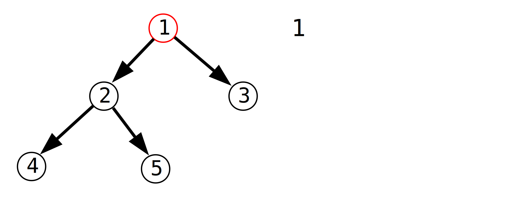

***

###### DFS & BFS

广度优先搜索 (BFS) 使用队列来实现。

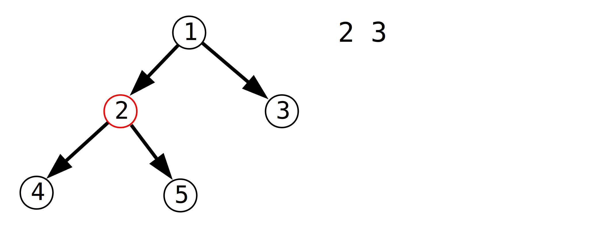

***

###### DFS & BFS

广度优先搜索 (BFS) 使用队列来实现。

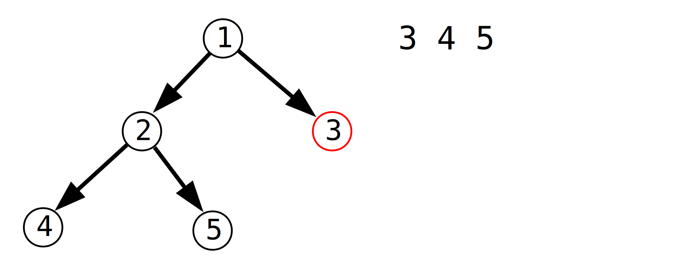

***

###### DFS & BFS

广度优先搜索 (BFS) 使用队列来实现。

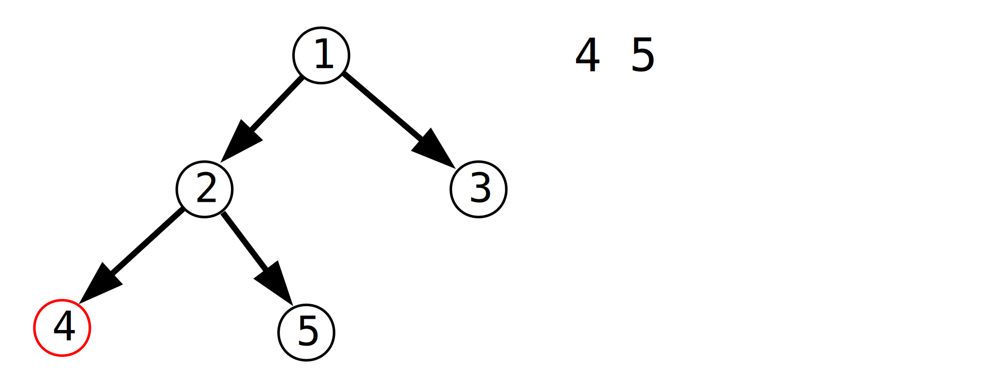

***

###### DFS & BFS

广度优先搜索 (BFS) 使用队列来实现。

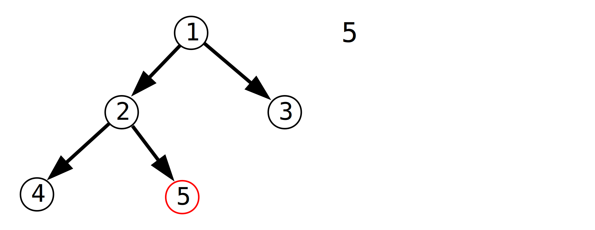

---

BFS 总是尝试先遍历距离近的状态，在访问距离远的状态。

***

###### 应用：计算表达式

利用栈可以处理简单的表达式计算，支持运算优先级、括号、加法 (+)、减法 (-)、乘法 (*)、除法 (/) 以及幂运算 (^)。

---

一般我们书写的表达式称为**中缀表达式**，因为运算符号放在两个操作数中间。

---

**后缀表达式**更加便于计算，举个例子：

```
8 - (3 + 2 * 6) / 5 + 4  --->   8 3 2 6 * + 5 / - 4 +
```

---

右边是对应的后缀表达式。运算时从左至右遍历所有元素，如果是数字就压入栈中，如果是运算符就从栈顶取出两个元素进行运算，得到结果后有压回栈中。

---

上面的表达式运算如下：

```
stack: 8 3 2 6，读入 *，计算 2 * 6 = 12
stack: 8 3 12，读入 +，计算 3 + 12 = 15
stack: 8 15 5，读入 /，计算 15 / 5 = 3
stack: 8 3，读入 -，计算 8 - 3 = 5
stack: 5 4 读入 +，计算 5 + 4 = 9，即计算结果
```

***

###### 中缀转后缀

将中缀表达式转为后缀表达式从而能够简单地计算表达式。利用栈也可以实现。

---

在后缀表达式中，数字的相对位置没有改变，运算符的相对位置出于优先级的缘故会发生变化。后缀表达式由于处理了优先级的问题，所以没有输出括号。

具体转化规则如下：

---

1. 遇到数字直接输出。
---
2. 遇到运算符和左括号压入符号栈。
---
3. 遇到右括号则一直弹栈输出直到遇到左括号。
---
4. 压入运算符时，如果栈顶符号不为括号且运算符优先级**不小于**当前运算符，则弹出栈顶运算符并输出。直到**栈空**或者遇到左括号或优先级低的运算符时停止弹栈，压入当前的运算符。
---
5. 读入结束后弹出栈内所有运算符。

---

试一试：`(8 + (7 - 6) + 5) + 4 * 3 / 2 * (1 + 9)`

---

`8 7 6 - + 5 + 4 3 * 2 / 1 9 + * +`

---

题目链接：[【LG P1175】](https://www.luogu.org/problemnew/show/P1175)

***

###### 广搜 / 双向广搜

BFS 总是优先访问距离近的状态，所以经常用于搜索最小值。

---

例题：[【LG P1126】](https://www.luogu.org/problemnew/show/P1126)

题目大意：一个机器人在网格图上走路，求从一个点走到另一个点的最短时间。

机器人每单位时间可以向前走 $1$ 步、$2$ 步和 $3$ 步，以及左转和右转。网格图上有障碍物。网格图最大 $50 \times 50$。

---

可以记录机器人的坐标和方向作为状态，同时记录已经消耗的时间，对于机器人的每种操作，先检查是否可行，然后更改状态后入队。到达了目的地时输出答案。

***

###### 广搜 / 双向广搜

双向广搜是一种减少 BFS 访问的状态数量的技巧。简单的 BFS 只从起点状态开始搜索，而双向广搜同时从起点和终点开始搜索。当两边访问了同一个状态时说明搜索完成。

---

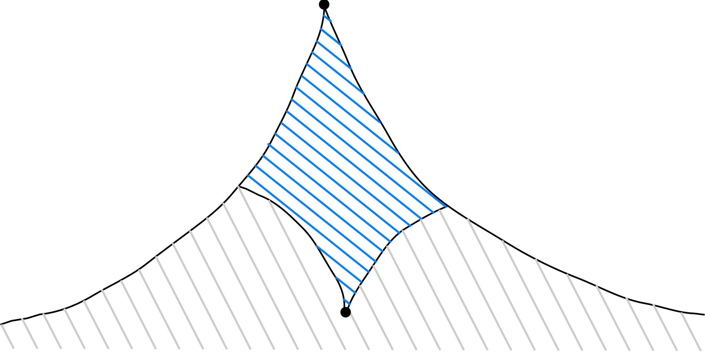

（灰色部分表示双向广搜优化掉的状态）

---

另一个广搜练习题：[【LG P1379】](https://www.luogu.org/problemnew/show/P1379)

***

###### 单调栈 ＆ 单调队列

所谓单调栈，就是元素按照单调递增或者单调递减的顺序排列的栈。

---

例题：给定一个长为 $n$ 的整数序列，求出序列中每个元素右边第一个比该元素小的元素。如果没有则输出 $0$。$n \leqslant 10^6$。

---

```
7 2 1 4 5 1 3 2
2 1 0 1 1 0 2 0
```

---

维护一个单调递增的栈，从左至右遍历序列。考虑当前处理到元素 $x$，栈顶元素为 $y$。如果 $x < y$，那么可以知道 $y$ 右边第一个比 $y$ 小的元素就是 $x$。

---

所以 $y$ 的答案就计算出来了，可以将 $y$ 从栈中弹出。

---

如此处理之后，要么栈已经空了，要么栈顶元素 $y \leqslant x$ 。将 $x$ 压入栈中，栈中元素依然保持单调递增。

---

整个序列遍历完毕后，栈中剩下的元素均无答案。时间复杂度为 $\Theta(n)$。

***

###### 单调栈 ＆ 单调队列

例题：[【HDU P1506】](http://acm.hdu.edu.cn/showproblem.php?pid=1506)

题目大意：给定一个柱状图，求其中的面积最大子矩形（即下图阴影部分）。


---

以每个柱子做高，向左和向右分别找出第一个比它矮的柱子，这个是能覆盖的**极大**子矩形。

---

可以使用正反两次单调栈扫描完成上述搜索。

类似题：[【LG P1901】](https://www.luogu.org/problemnew/show/P1901)

***

###### 单调栈 ＆ 单调队列

单调队列与单调栈类似，只不过允许从队首弹出。

---

例题：[【LG P1440】](https://www.luogu.org/problemnew/show/P1440)

题目大意：给定一个长度为 $n$ 的序列，求出每一个长度为 $m$ 的区间内的最小值。$n \leqslant 2 \times 10^6$。

---

```
m = 2
7 8 1 4 3 2
  7 1 1 3 2
```

---

实际上这是一个叫做 “滑动窗口” 的技巧。假设现在我们已经处理了一个长度为 $m$ 的区间 $[l,\,r]$，在右边加入一个元素得到 $[l,\,r + 1]$，然后从左边删除一个数字就得到了下一个长度为 $m$ 的区间 $[l + 1,\,r + 1]$。

---

加入一个数字求最小值很简单，删除一个数字就没那么简单了。

---

注意到我们只会从左边删除，考虑在区间内维护一个从左至右递增的队列，相当于是最小值的候选队，队首就是当前的最小值。如果最小值被删除，它后面一位就是能够顶替它的新的最小值。

---

右边加入元素可以像之前单调栈那样维护队列的单调性。

***

###### 选做题 #1

[【NOIP 2017 Day2 T2 / LG P2827】](https://www.luogu.org/problemnew/show/P2827)：蚯蚓

---

***Hint***: 寻找单调性。

***

###### 选做题 #2

仅利用两个栈，和 $\Theta(1)$ 的额外空间，实现一个双端队列。要求：

1. 在队首、队尾执行插入、删除操作的时间复杂度为 $\Theta(1)$。
2. 支持 $\Theta(1)$ 随机访问队列中的任意元素。

***

###### 选做题 #3

记无穷乘积 $S$ 为：
$$
\begin{aligned}
S &= \prod_{k = 1}^\infty {2^k + 1 \over 2^k} = \prod_{k = 1}^\infty \left(1 + {1 \over 2^k}\right) \\
&= \frac32\cdot\frac54\cdot\frac98\cdot\frac{17}{16}\cdots
\end{aligned}
$$
证明：$2 < S < 3$。

---

***Hint***: 直线 $l: y = x - 1$ 与自然对数 $y = \ln x$ 的图象相切于 $(1,\,0)$。