# 链表　DLX　并查集

## July 16, 2018, riteme

***

###### 单向链表

最简单的链表：只存储每个元素的数据和指向下一个元素 (后继) 的指针。

```c++
struct Node {
	int data;
    Node *nxt;
};
```

---

如果 `nxt` 为 `NULL` ，表示链表的最后一个元素。

---

支持 $\Theta(1)$ 在某个元素后面插入、删除，以及两个链表的拼接。

---

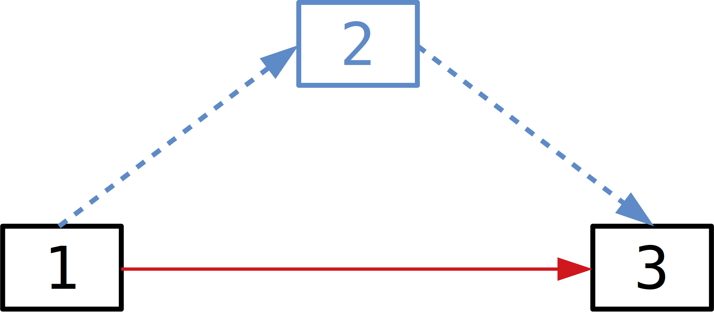

---


---

注意处理初始时链表为空的情况。

---

如果没有辅助数组，链表无法快速访问内部元素。

***

###### 双向链表

添加一个前驱指针 `pre` 使得可以在链表中双向移动。

---

**初赛填空题：**补全双向链表的插入与删除操作：

---

```c++
struct Node {
    Node(int v) : data(v), pre(NULL), nxt(NULL) {}
    int data;
	Node *pre, *nxt;
};

void insert(Node *x, int v) {  // 将 v 插入到节点 x 后方
    assert(x);  // 保证 x != NULL
    Node *y = new Node(v);
    // FIXME!
}

void remove(Node *x) {
    // FIXME!
}
```

----

```c++
struct Node {
    Node(int v) : data(v), pre(NULL), nxt(NULL) {}
    int data;
	Node *pre, *nxt;
};

void insert(Node *x, int v) {  // 将 v 插入到节点 x 后方
    assert(x);  // 保证 x != NULL
    Node *y = new Node(v);
    y->pre = x; y->nxt = x->nxt;
    if (x->nxt) x->nxt->pre = y;
    x->nxt = y;
}

void remove(Node *x) {
    if (x->pre) x->pre->nxt = x->nxt;
    if (x->nxt) x->nxt->pre = x->pre;
    // x->pre = x->nxt = NULL;
}
```

---

谨防段错误！

***

###### 循环链表

链表首尾相接变成一个环，构成了循环链表。循环列表支持从链表中任意一个元素开始遍历整个链表。

---

如果链表中只有一个元素，构成一个**自环**。

---

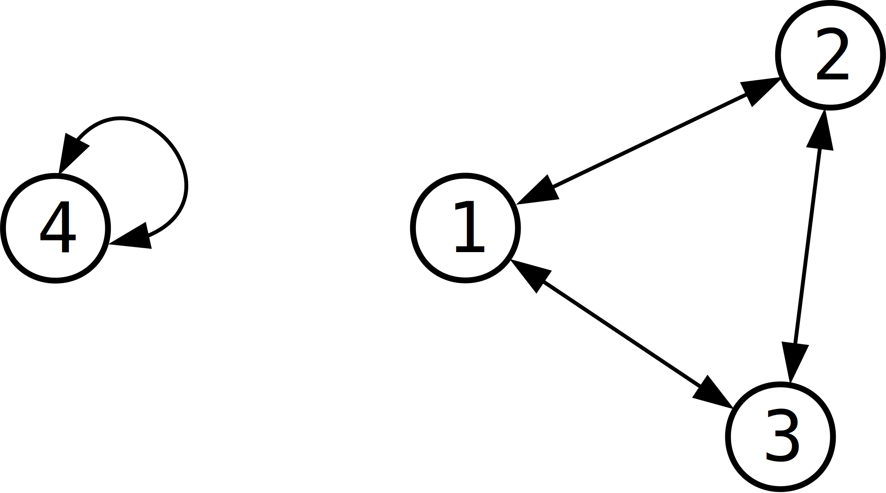

---

双向链表中每个元素任何时候都有前驱和后继，因而代码上可以省去几个 `if` 判断。

***

###### 循环列表：模拟约瑟夫问题

[【洛谷 P1996】](https://www.luogu.org/problemnew/show/P1996)：$n$ 个人排成一圈，从第一个人开始报数 $1,\,2,\,3,\,\dots$，数到 $m$ 的人就出列，然后重新从 $1$ 开始报数。依次输出出列的人的编号。$n,\,m \leqslant 100$。

---

数据范围这么小简直就是在~~侮辱智商~~哈哈哈。

----

建一个循环链表，然后按照题意模拟就 OK 了。

***

###### Dancing Links: 精确匹配

DLX (**D**ancing **L**ink**S**) 是高德纳爷爷 (Donald Knuth) 为了解决**精确匹配问题**而设计的一种*数据结构*。

---

**精确匹配问题：**在一个 $n \times m$ 的 $0$/$1$ 矩阵中（$n$ 行 $m$ 列），选出一些行，使得每一列上**有且仅有**一个 $1$。输出所有方案。

---

$$
\left[\begin{matrix}
\color{blue}0 & \color{blue}0 & \color{red}1 & \color{blue}0 & \color{red}1 & \color{red}1 & \color{blue}0 \\
1 & 0 & 0 & 1 & 0 & 0 & 1 \\
0 & 1 & 1 & 0 & 0 & 1 & 0 \\
\color{red}1 & \color{blue}0 & \color{blue}0 & \color{red}1 & \color{blue}0 & \color{blue}0 & \color{blue}0 \\
\color{blue}0 & \color{red}1 & \color{blue}0 & \color{blue}0 & \color{blue}0 & \color{blue}0 & \color{red}1 \\
0 & 0 & 0 & 1 & 1 & 0 & 1
\end{matrix}\right]_{6 \times 7 \text{ matrix}}
$$

---

暴力枚举算法：枚举 $2^n$ 种选取行的情形，利用链表加速 $\Theta(n + m)$ 时间检查是否合法。

---

DLX: 优化搜索 + 剪枝的过程。

***

###### 暴力搜索

直接暴力搜索的一种流程：

---

1. 如果当前矩阵没有列，则要求满足。
---
2. 任意选取一列，如果这一列上没有 $1$，则无解。
---
3. 否则依次遍历这一列上所有有 $1$ 的行，其中必须有一行被选中。~~钦定~~某一行被选中，删去所有被覆盖的列和不能再选择的行，得到一个更小的矩阵，递归下去处理。

---

$$
\left[\begin{matrix}
0 & 0 & 1 & 0 & 1 & 1 & 0 \\
1 & 0 & 0 & 1 & 0 & 0 & 1 \\
0 & 1 & 1 & 0 & 0 & 1 & 0 \\
1 & 0 & 0 & 1 & 0 & 0 & 0 \\
0 & 1 & 0 & 0 & 0 & 0 & 1 \\
0 & 0 & 0 & 1 & 1 & 0 & 1
\end{matrix}\right]
$$

----

$$
\left[\begin{matrix}
0 & 0 & \color{blue}1 & 0 & 1 & 1 & 0 \\
1 & 0 & \color{blue}0 & 1 & 0 & 0 & 1 \\
0 & 1 & \color{blue}1 & 0 & 0 & 1 & 0 \\
1 & 0 & \color{blue}0 & 1 & 0 & 0 & 0 \\
0 & 1 & \color{blue}0 & 0 & 0 & 0 & 1 \\
0 & 0 & \color{blue}0 & 1 & 1 & 0 & 1
\end{matrix}\right]
$$

----

$$
\left[\begin{matrix}
\color{orange}0 & \color{orange}0 & \color{orange}1 & \color{orange}0 & \color{orange}1 & \color{orange}1 & \color{orange}0 \\
1 & 0 & \color{blue}0 & 1 & 0 & 0 & 1 \\
0 & 1 & \color{blue}1 & 0 & 0 & 1 & 0 \\
1 & 0 & \color{blue}0 & 1 & 0 & 0 & 0 \\
0 & 1 & \color{blue}0 & 0 & 0 & 0 & 1 \\
0 & 0 & \color{blue}0 & 1 & 1 & 0 & 1
\end{matrix}\right]
$$

----

$$
\left[\begin{matrix}
\color{orange}0 & \color{orange}0 & \color{orange}1 & \color{orange}0 & \color{orange}1 & \color{orange}1 & \color{orange}0 \\
1 & 0 & \color{blue}0 & 1 & \color{blue}0 & \color{blue}0 & 1 \\
0 & 1 & \color{blue}1 & 0 & \color{blue}0 & \color{blue}1 & 0 \\
1 & 0 & \color{blue}0 & 1 & \color{blue}0 & \color{blue}0 & 0 \\
0 & 1 & \color{blue}0 & 0 & \color{blue}0 & \color{blue}0 & 1 \\
0 & 0 & \color{blue}0 & 1 & \color{blue}1 & \color{blue}0 & 1
\end{matrix}\right]
$$

----

$$
\left[\begin{matrix}
\color{orange}0 & \color{orange}0 & \color{orange}1 & \color{orange}0 & \color{orange}1 & \color{orange}1 & \color{orange}0 \\
1 & 0 & \color{blue}0 & 1 & \color{blue}0 & \color{blue}0 & 1 \\
\color{red}0 & \color{red}1 & \color{blue}1 & \color{red}0 & \color{blue}0 & \color{blue}1 & \color{red}0 \\
1 & 0 & \color{blue}0 & 1 & \color{blue}0 & \color{blue}0 & 0 \\
0 & 1 & \color{blue}0 & 0 & \color{blue}0 & \color{blue}0 & 1 \\
\color{red}0 & \color{red}0 & \color{blue}0 & \color{red}1 & \color{blue}1 & \color{blue}0 & \color{red}1
\end{matrix}\right]
$$

---

删去被染色的行和列后，得到更小的矩阵：
$$
\left[\begin{matrix}
1 & 0 & 1 & 1 \\
1 & 0 & 1 & 0 \\
0 & 1 & 0 & 1 \\
\end{matrix}\right]
$$

---

继续搜索发现只要选择第二和第三行即可（原第四和第五行）。最后得到一组解：选择 $1$、$4$、$5$ 行。

***

###### 十字链表

能有解的矩阵一般 $1$ 都比较稀疏，而暴力搜索花费了大量时间在遍历 $0$ 上面。

---

为了避免访问无用的 $0$，考虑将所有 $1$ 单独建立一个节点，构造**十字链表**：

---

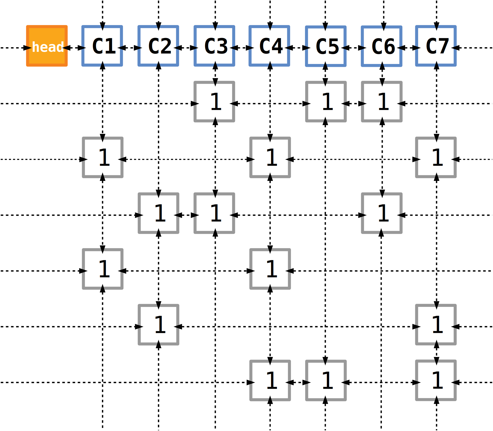

---

每个节点同时处在横排和竖排两个*循环双向链表*中。最上面一排 `C1` 至 `Cm` (`C7`) 是辅助节点，用于快速寻找未被覆盖的竖排。`head` 节点也是用于方便遍历所有现存的列的辅助节点。

***

###### Dancing Links

暴力搜索还有一个比较费时间的地方：每次递归前都要保存现有的状态，确保能够回溯。DLX 在这方面有突出优势。回忆一下循环链表的删除操作：

---

```c++
void remove(Node *x) {
    x->pre->nxt = x->nxt;
    x->nxt->pre = x->pre;
    // x->pre = x->nxt = NULL;
}
```

---

如果保留 `x->pre` 和 `x->nxt` 的值不变，那么可以通过下面的操作将 `x` *还原*到链表中：

```c++
void restore(Node *x) {
    x->pre->nxt = x->nxt->pre = x;
}
```

---

所以我们利用一个*栈*，依次将被删除的节点压入栈中。回溯时就一直弹栈，恢复节点。

---

因此 DLX 是**可撤销数据结构**。

***

###### 一点~~小~~优化

实际上，如果按上面的方式实现，速度还不是很理想。

---

搜索相比于暴力枚举 $2^n$ 种情况的方法，可以在递归的过程中剪去不必要的搜索。而 DLX 简化了搜索过程中不必要的步骤。

---

为了能够尽可能避免回溯，每次选取含有 $1$ 的个数最少的一列。

---

可以看到，如果矩阵中存在没有 $1$ 的列，那么矩阵不合法，上述优化能够直接检测到。

---

对于绝大部分情况，这个算法可以比较轻松地跑过 $n,\,m \approx 500$ 的数据。

***

###### 精确覆盖：平面密铺

例题：用 $13$ 种俄罗斯方块密铺 $n \times m$ 的方格纸，计算方案总数。$n,\,m \leqslant 15$。

---


---

**构建模型：**考虑精确覆盖问题：每一列有且仅有一个 $1$。

---

而密铺问题中：每一个格子能且只能被俄罗斯方块覆盖一次。因此尝试构造矩阵，方格纸上每一个格子对应一列。

---

对于每种方块，首先可能有多种旋转的方式，其次在网格上不同的位置会占据不同的格子，对应在矩阵中某一行的相应的列上填 $1$。

---

枚举所有方块摆放的可能性，构造矩阵跑精确匹配即可。

***

###### 精确覆盖：Soduku

精确匹配的另外一个经典应用就是求解数独：

---

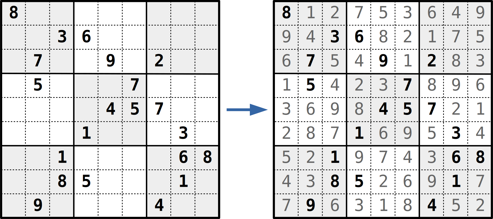

<center><span style="font-size: 1px">号称 “世界最难数独”</span></center>

---

数独的规则：

---

1. 每一行中 $1..9$ 各出现一次。
---
2. 每一列中 $1..9$ 各出现一次。
---
3. 每一个九宫格中 $1..9$ 各出现一次。
---
4. **每个格子上只能填一个 $1..9$ 中的数字**。

--------

**构建模型：**注意到上面的每一条规则都对应着 $9 \times 9 = 81$ 个要求。例如第二行中出现 $3$、第三行第四列上要有数字。总共 $324$ 个要求，对应矩阵中 $324$ 列。

---

对于每一种填数字的情况，即在第 $x$ 行、第 $y$ 列上填数字 $c$，至多 $9^3 = 729$ 种。注意有一些格子已经提前给出。每一种情况会满足一些要求，根据这一点来填充矩阵。

---

练手题：[【洛谷 P1784】](https://www.luogu.org/problemnew/show/P1784)、[【POJ 3076】](http://poj.org/problem?id=3076)

---

**问题：**可以使用精确匹配解决 $n$ 皇后问题吗?

***

###### 并查集

并查集原名**不相交集合数据结构**。并查集是它支持的操作的名称的简写：合并、查询。

---

具体而言，并查集支持以下操作：

---

1. 合并两个集合。
---
2. 查询两个元素是否在同一集合内。

---

初始时，共有 $n$ 个元素，分属不同的集合。

---

为了方便，我们在每个集合中选出一个代表元素来表示这个集合：

---


----


----


----


---

这样我们的并查集就只需要支持两种操作：

---

1. `link`: 将两个集合合并，按集合内的代表元素作为参数传入。
---
2. `find`: 查找一个元素所在集合的代表元素。

---

实际上合并两个集合是从这两个集合中各选出一个元素，执行两次 `find` 找出代表元素，然后执行 `link` 操作来实现的。

***

###### 并查集：基本结构

使用**树**可以很方便地表示并查集：

---

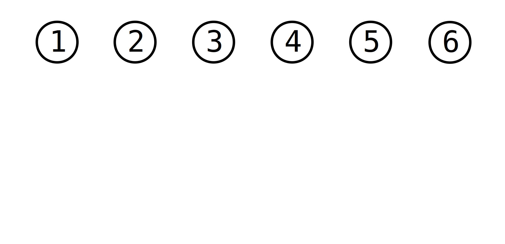

----

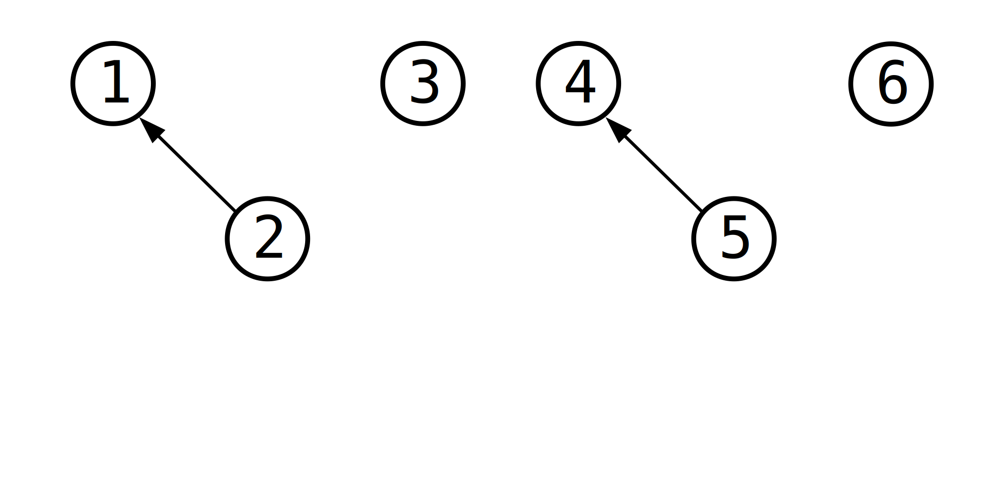

----

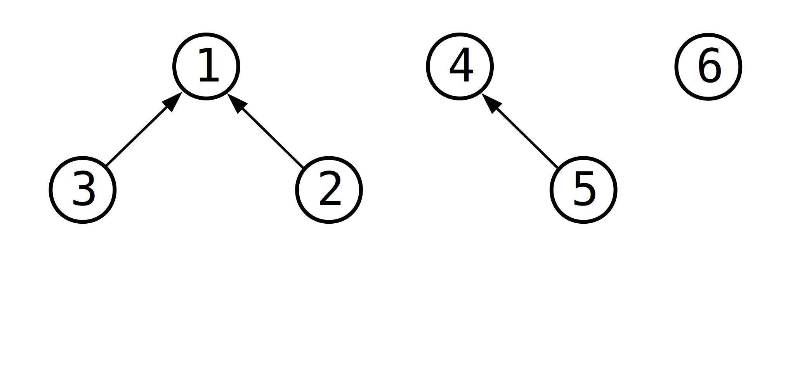

----

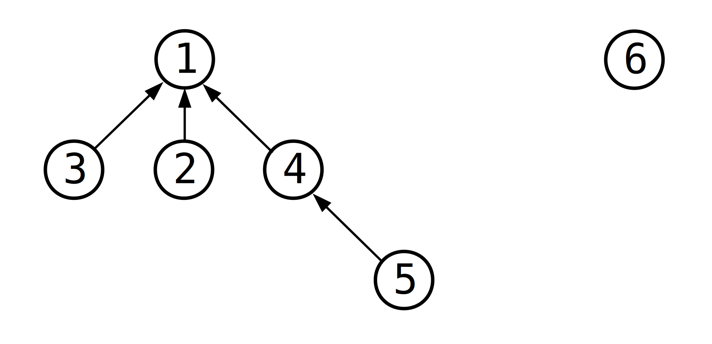

---

类似于一堆的单向链表，为每个元素记录一个**父亲**指针 `father` 就可以实现。如果 `father` 为 `NULL`，说明该元素为**树根**，也就是这个集合的代表元素。

---

```
function link(int x, int y):
	// 保证 x 和 y 均为树根
	assert father[x] == NULL
	assert father[y] == NULL
	if x == y: return
	father[x] = y
function find(int x):
	while father[x] != NULL:
		x = father[x]
	return x
```

---

So easy?

----

So ~~***naïve***~~!

***

###### 并查集：按秩合并

如果这样实现，时间复杂度是 $O(n)$ 的。因为我们的 `link` 操作可以将 $n$ 个元素连成长长的一条链，然后对链底执行 `find`，会花费 $O(n)$ 的时间。

---

所以树的高度直接决定了 `find` 最坏情况下花费的时间。因此优化的重点在于降低树的高度。

---

**按秩合并：**记录每棵树的高度，每次合并时，选取较高的树作为树根。

---

所谓树的**高度**，又称作**秩**，就是所有点到根节点的路径上，经过的边的数量的最大值。

---


---

可以为每个元素再记录一个 `rank` 值，表示树的秩。

***

###### 按秩合并：实现

注意到我们只需要树根的 `rank` 值，而树根的 `father` 值为空，其余元素的 `father` 值均大于 $0$。为了充分利用空间，树根的 `father` 可以存储 -`rank`。

---

```
function link(int x, int y):
	if x == y: return
	if father[x] > father[y]: swap(x, y)  // -father[x] < -father[y]
	if father[x] == father[y]: father[x]--  // 只有两棵树高相同时，合并后的树高才会增加
	father[y] = x
function find(int x):
	while father[x] > 0:  // father[x] > 0 意味着不是树根
		x = father[x]
	return x
```

***

###### 按秩合并：时间复杂度

这种策略看上去非常有道理，实际上也非常实用。可以证明，采用按秩合并策略，树的高度为 $O(\log n)$。意味着 `find` 操作的时间复杂度为 $O(\log n)$。

---

***Review***: $2^{\log n} = n$

---

**定理**　执行按秩合并策略，高度为 $h$ 的树中至少有 $2^h$ 个元素（节点）。

---

**证明**　运用数学归纳法：如果 $h = 0$，则只有一个节点，树中有 $2^0 = 1$ 个节点。现在假设对于 $0..h - 1$，该结论均成立，现在尝试证明树高为 $h$ 时也成立。

---

考虑如何才能使树的高度加 $1$。这需要两棵秩为 $h - 1$ 的树进行合并。根据归纳假设，这两棵树分别至少有 $2^{h - 1}$ 个元素，合并之后至少有 $2^{h-1} + 2^{h-1} = 2^h$ 个元素。<span style="float: right">$\blacksquare$</span>

---

取 $H \geqslant \log n$，则 $2^H \geqslant n$，所以树高不超过 $H$，即树高为 $O(\log n)$ 级别的。

***

###### 路径压缩

另外一个相当给力也相当直观的策略就是**路径压缩**了。这个策略针对 `find` 操作下手。由于我们只有合并操作，也就是说同一集合中的元素只增不减，所以一棵树的形态其实可以随意更改而没有任何副作用。当然最理想的情况自然是这样：

---


---

但如果每次都变成这样就和暴力无异了。路径压缩是一种偷懒的做法：合并的时候什么都不做，而在 `find` 的时候将所有遍历到的元素的 `father` 全部改为根节点。

---

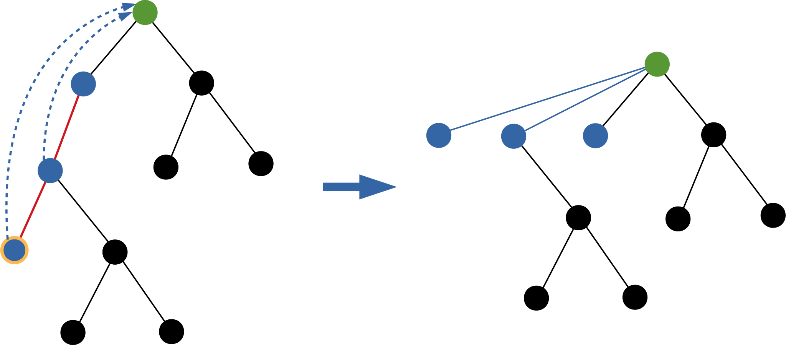

***

###### 路径压缩：实现

代码真的相当简单：

---

```c++
int find(int x) {
    return father[x] ? father[x] = find(father[x]) : x;
}
```

***

###### 路径压缩：时间复杂度

先摆一个事实：目前 $98\%$ 的 OI 代码里面的并查集，都只用了路径压缩优化......

---

因为大部分数据是随机的，只需要一个路径压缩，并查集速度就很快了，平均下来 `find` 操作接近 $O(1)$......

---

**结论：**不出意外，你只写个路径优化就 OK 了。~~并查集只有两行代码~~。

---

实际上，只使用路径压缩的*均摊*时间复杂度为 $O(\log n)$。

***

###### 路径压缩：时间复杂度

**证明**　考虑将树上的边进行分类：记边为 $e: u \rightarrow v$，即 $\mathrm{father}[u] = v$，如果 $\mathrm{size}[u] \leqslant \frac12 \mathrm{size}[v]$，则称 $e$ 为轻边。从 $v$ 走到 $u$，子树大小减半。否则称为重边。

---

从根节点一直向下走，最多走 $\lceil \log n \rceil$ 条轻边，因为每走一次子树大小就会减半，减到小于等于 $1$ 就没法走了。

---

每次 `find` 将路径上的边 $e: u \rightarrow v$ 改接到根节点 $r$ 下面去，即变成 $u \rightarrow r$。那么子树 $v$ 中将删去子树 $u$。如果 $e$ 是重边，那么每删去一次 $\mathrm{size}[v]$ 就会减半。对于 $v$ 而言，它最多进行 $\lceil \log n \rceil$ 次这样的操作。

---

现在来综合一下，每次 `find` 操作，要么改接轻边，要么改接重边。根据轻边的性质，每次 `find` 至多改接 $O(\log n)$ 条轻边。根据重边的性质，每个元素（节点）处只会进行 $O(\log n)$ 次改接。

---

如果 `find` 操作的总数为 $q$，元素总个数为 $n$，则执行 $q$ 次 `find` 操作的总时间复杂度为 $O((n + q) \log n)$。假设 $q \geqslant n$，将总时间平均到每次 `find` 操作上，于是每次 `find` 操作相当于只花费了 $O(\log n)$ 的时间。

***

###### 路径压缩：时间复杂度

当然，正如前面所说的，路径压缩后的并查集几乎单次操作是 $O(1)$ 的，那是因为出题人太良心没卡你们，~~因为出题人总是太懒因为卡了也没什么效果~~。

---

如何卡只写了路径压缩的并查集呢？

---

使用**二项树**。

***

###### 二项树

$0$ 阶 (order) 二项树只有一个节点。

---

$k$ 阶二项树有 $k$ 个儿子，分别为 $0$ 至 $k - 1$ 阶二项树。

---

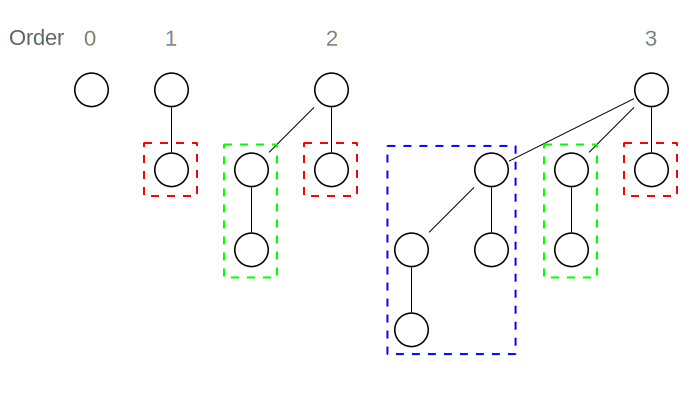

---

**性质 1**　$k$ 阶二项树有 $2^k$ 个节点。

---

**证明**　$0$ 阶二项树有 $2^0 = 1$ 个节点，运用数学归纳法，假设对于 $0$ 至 $n - 1$ 阶均成立（$n \geqslant 1$），那么对于 $n$ 阶二项树，总共有 $\sum_{k = 0}^{n - 1} 2^k + 1 = 2^n - 1 + 1 = 2^n$ 个节点，归纳假设成立。

-----

**性质 2**　$k$ 阶二项树的树高为 $k$（这里的树高指树上节点到根的最长路径上节点个数）

---

**证明**　结论过于 trivial，~~狗眼~~观察即可。

-----

**性质 3**　$n$ 阶二项树上深度为 $k$ 的节点总数为 ${n \choose k}$。

---

这个我就不证了，现在对我们来说没什么用，只是告诉你为什么这树叫**二项**树。

---

如何用二项树来卡并查集呢？

***

###### 性质 4：Self-Producing

先来看看如果 `find` 二项树中最深的节点会怎么样：将一棵 $4$ 阶二项树与一个单独的节点 `link` 起来，然后 `find` 最左下角的节点：

---


---

然后进入~~经典益智游戏 “找不同”~~：

---


***

###### 性质 4：Self-Producing


不难发现，除了最左边那个节点。剩下的部分依旧是一棵 $4$ 阶二项树。

---

这是因为 $k$ 阶二项树本身就是由两棵 $k - 1$ 阶二项树合并而来，而上面的 `find` 操作正好将每一阶二项树左边拆掉了，留下右边接到根节点下面，所以结果还是一棵二项树。

---

令 $n = 2^k$，假设 $k \geqslant 1$，那么先构建一棵 $k - 1$ 阶二项树，此时还剩下 $2^{k - 1} = n/2$ 个没有用到的元素，依次将它们与当前二项树合并后 `find` 最深处的节点，每次 `find` 会访问 $k = \log n$ 个节点，这样 `find` 就被卡到时间复杂度上界了。

---

所以只使用路径压缩的并查集，`find` 的时间复杂度为 $O(\log n)$ 是一个**紧**的上界。

***

###### 并查集：时间复杂度

最极致的优化就是路径压缩与按秩合并一块用。这样做的话，`find` 的时间复杂度是均摊 $O(\alpha(n))$。$\alpha(n)$ 是 Ackermann 反函数。当 $n \leqslant 10^{80}$ 时，$\alpha(n) \leqslant 3$。基本上可以认为是 $O(1)$ 了。

---

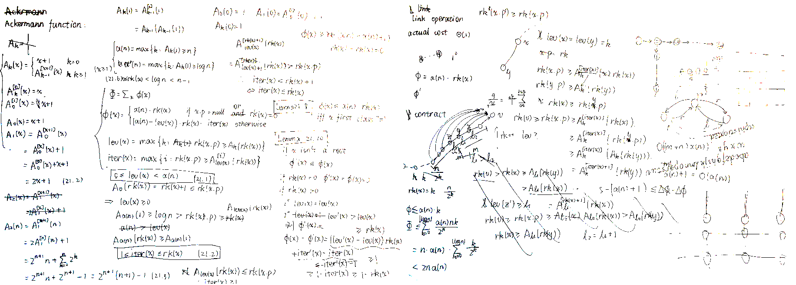

《算法导论》21.4 节上有这个结论的证明，学有余力的同学可以阅读一下。虽然有整整 $9$ 页文字，实际上都是比较初等的推理。这里我不会再重新打一遍到课件上了。上图是我看的时候整理的证明过程，其实只用了一张半纸 ~~QAQ~~

---

~~如果要现在讲的话这节课的重点就不对了~~

***

###### 例题时间

是时候讲点题目了

***

###### [【NOI 2015 / LG P1955】](https://www.luogu.org/problemnew/show/P1955)程序自动分析

有 $10^9$ 个变量，分别为 $x_1$ 至 $x_{10^9}$，此外还有 $n$ 个已知条件。每个已知条件会指定两个数字 $i$ 和 $j$，要么是 $x_i = x_j$，要么是  $x_i \neq x_j$。需要判断这 $n$ 个条件是否有冲突。$n \leqslant 10^5$。

---

~~**感动中国 2015 NOI 送分题**~~

----

等式具有传递性，将相等的变量放入一个集合内，用并查集进行维护。处理完所有等式之后就可以知道哪些变量是相等的了。

---

然后考虑所有的不等式是否能满足要求。如果不等式两边的变量在同一个集合内，就说明发生了冲突。

***

###### [【LG P1621】](https://www.luogu.org/problemnew/show/P1621)集合

给定 $A$、$B$ 和 $P$，初始时为所有满足 $A \leqslant n \leqslant B$ 的每个整数 $n$ 单独建立一个集合。之后，如果存在两个**处在不同集合**的数字 $x$ 和 $y$ 之间有**不小于** $P$ 的公共**质**因子，则将 $x$ 和 $y$ 所在的集合合并。问最后会剩下几个集合。$A,\,B \leqslant 10^5$，$2 \leqslant P \leqslant B$。

---

枚举 $[P,\,B]$ 中的所有质数 $p$，将 $p$ 在范围 $[A,\,B]$ 内的所有倍数用并查集连起来，最后统计不同的集合个数。

***

###### [【BOI 2003 / LG P1892】](https://www.luogu.org/problemnew/show/P1892)团伙

有 $n$ 个强盗和 $m$ 条信息，每条信息会表明某两个强盗之间是**朋友关系**还是**敌人关系**。并且他们坚信：

* 朋友的朋友是朋友
* 敌人的敌人也是朋友

朋友之间会构成团伙。现在根据 $m$ 条信息推出 $n$ 个强盗之间会构成多少个团伙。$n,\,m \leqslant 10^5$。

---

如果关系是朋友，就直接连起来。

---

注意到一个人的所有敌人之间都是朋友关系，所以如果关系是敌人，先存起来，最后每个人的所有敌人之间都连起来即可。

***

###### [【IOI 2001 / LG P2024】](https://www.luogu.org/problemnew/show/P2024)食物链

动物王国中有三类动物 A、B、C，构成了循环的食物链：A 吃 B，B 吃 C，C 吃 A。现在有 $n$ 个动物（但我们不知道这些动物具体是哪一类的），和 $m$ 句话。这 $m$ 句话依次说出来，并且是以下两种说法之一：

1. 动物 $X$ 和动物 $Y$ 是同类。
2. 动物 $X$ 吃动物 $Y$。

如果一句话自相矛盾或者与之前说过的**真话**有冲突，则为假话，否则为真话。需要数出 $m$ 句话中假话的个数。$n,\,m \leqslant 10^5$。

---

由于不清楚动物的具体信息，所以尝试用假设的方法来处理。如果动物 $X$ 捕食动物 $Y$，那么当 $X$ 为 $A$ 时 $Y$ 就为 $B$，$X$ 为 $B$ 时 $Y$ 就为 $C$，......相当于是两者不同状态之间的等价关系。因此为每个动物建 $3$ 个点，分别表示其为 $A$、$B$ 和 $C$ 时的状态。使用并查集来处理这些等价关系，同时可以查询 “$X$ 为 $a$，$Y$ 为 $b$” 是否可以从之前的真话推出来。

---

上面是针对真话的处理方法，在这之前还需要判断一句话是不是真话。我们可以查询与这句话相矛盾的情况，在并查集中查询。如果并查集中没有查出，则为真话。

***

###### [【JSOI 2008 / LG P1197】](https://www.luogu.org/problemnew/show/P1197)星球大战

给定一个有 $n$ 个点 $m$ 条边的图，每次删去一个点，并询问删去后图中有几个连通块。$n,\,m \leqslant 2 \times 10^5$。

---

删除不好处理，倒过来变成添加，就变成并查集的拿手好戏了。

***

###### 选做题 #1

[【POJ 1417】True Liars](http://poj.org/problem?id=1417)

中文大意：一个岛上有 $p_1$ 个好人和 $p_2$ 个坏人，但是你不知道具体某一个人是好人还是坏人。你只知道**好人只讲真话，坏人只会撒谎**。为了了解哪些人是好人哪些是坏人，你一共问出了 $n$ 个问题，第 $k$ 个问题包含三个部分 $x_k$、$y_k$、$a_k$（$x_k$ 和 $y_k$ 是岛上居民的编号），表示你问 $x_k$：“$y_k$ 是不是好人？”，$a_k$ 是 $x_k$ 的回答，`yes` 或者 `no`。注意 $x_k$ 可以等于 $y_k$，这样就变成是问：“你是不是好人？”。

如果从你的询问中可以唯一推出哪些是好人，哪些是坏人，则输出所有好人的编号，一行输出一个，以 `end` 结尾。否则输出 `no`。

输入数据中包含多组数据，以 `0 0 0` 表示文件结束。

$n \leqslant 1000$，$p_1,\,p_2 \leqslant 300$

***

###### 选做题 #2

~~没找到提交地址 TAT~~

有 $q$ 个操作，每个操作是下面两种操作中的一种：

1. `ADD x`: 加入整数 $x$。
2. `EXTRACT`: 提取当前最大的整数，将其删去。

要求最后依次输出被提取出来的整数，不需要每次 `EXTRACT` 操作时就输出。（即允许离线操作）

$x,\,m \leqslant 10^6$

***

###### 思考题

相比于链表，`deque` 不但可以首尾 $O(1)$ 插入删除元素，还可以支持元素随机访问，那为什么还需要链表？

***

###### 扩展阅读

数据结构**跳表**：基于链表实现，维护一个有序的数列。支持插入、删除元素。

百度或 Google * 关键词 “跳表” 即可。

Wikipedia 页面：<https://en.wikipedia.org/wiki/Skip_list>

---

*: <https://google.ericfu.me/>